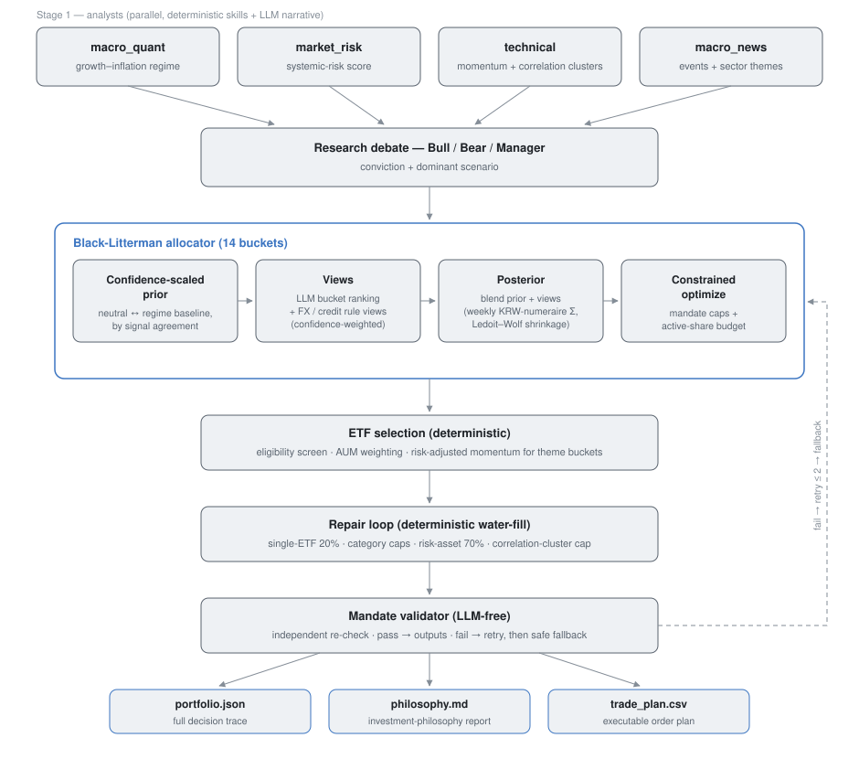

# DB GAPS Asset Allocation Agent

**English** | [한국어](README-ko_kr.md)

**Multi-agent asset-allocation system for Korean ETFs — a regime-conditional reference portfolio tilted by Black-Litterman views, with mandate compliance enforced deterministically on every run.**


This project started as a fork of [TauricResearch/TradingAgents](https://github.com/TauricResearch/TradingAgents) and was rebuilt from a stock-picking framework into a top-down asset-allocation system.

What it adds over the upstream: a **Korean listed-ETF universe** with a 14-bucket asset taxonomy, a **KRW-numeraire weekly covariance model**, a **confidence-scaled Black-Litterman prior** that interpolates between a neutral portfolio and a macro-regime baseline by a deterministic signal-agreement score, and **deterministic compliance** — mandate caps are enforced by a repair loop and re-checked by an LLM-free validator on every run.



## Why

Built for the 12th **DB GAPS investment competition** (2026-06-01 → 2026-08-31): a 1B KRW mock account restricted to 188 Korean listed ETFs, scored **30% on returns and 70% on investment philosophy** — consistency between the stated plan and actual operation, defensive logic under stress, and single-risk control based on internal correlations rather than surface-level diversification.

That scoring rule shaped the architecture. The system separates **deterministic decisions** (regime classification, covariance, ETF selection, cap repair, mandate validation) from **LLM judgment** (narratives, debate, bounded relative views), so every allocation is reproducible, attributable, and auditable — a coherent philosophy trail matters as much as the allocation itself.

A second, harder requirement: rule violations mean disqualification without warning. The system therefore validates the mandate **on every run**:

| Rule | Constraint | Enforced by |
|---|---|---|
| Risk assets (domestic/foreign equity, FX, commodities) | ≤ 70% | repair loop + validator |
| Any single ETF | ≤ 20% | optimizer constraint + repair + validator |
| Per-category caps (e.g. domestic equity-sector ≤ 15%) | rulebook table | repair + validator |
| Correlated-cluster weight | cluster cap | cluster repair + validator |
| Initial turnover (first 5 trading days) | ≥ 80% | monitor + alerts |
| Monthly turnover | ≥ 10% each month | MTD tracking + alerts |

See [`docs/competition-rules-summary.md`](docs/competition-rules-summary.md) for the full rule-to-code mapping.

## Quickstart

```bash
# 1. Install (pure Python — no TA-Lib system package needed)
pip install -e ".[test]"

# 2. Keys: FRED_API_KEY, ECOS_API_KEY, and one LLM provider key (default: OpenAI)
cp .env.example .env    # then edit

# 3. Run the full pipeline → 3 outputs under artifacts/{date}/
gaps plan --date 2026-06-05 --capital 1000000000
```

The ETF universe ships as [`data/universe.json`](data/universe.json); no extra download is needed. Other frequently used commands:

| Command | Purpose |
|---|---|
| `gaps plan` | Full pipeline: analysis → allocation → validation → outputs |
| `gaps rebalance {daily,weekly,monthly}` | Tiered rebalancing from current holdings |
| `gaps validate` | Mandate check on an existing portfolio |
| `gaps monitor` | Operations monitoring (turnover / exposure / drift) |
| `gaps macro` | Single-analyst debug (regime / risk / news / technical) |

## Features

- **Six-stage LangGraph pipeline** — four parallel analysts → research debate → allocator → validator → outputs, connected by compact summary handoffs; every LLM output is schema-locked with Pydantic.
- **Regime-conditional reference portfolio + BL view engine** — the prior is a hand-set, regime-conditional reference portfolio (deliberately *not* canonical equilibrium Black-Litterman; see [LIMITATIONS.md](LIMITATIONS.md)); LLM relative-ranking views and deterministic FX/credit rule views tilt it through confidence-weighted view blending.
- **Confidence-scaled prior** — a deterministic signal-agreement score (computed from macro-snapshot votes, not the LLM's self-reported confidence) interpolates the prior between a neutral portfolio and the regime baseline, so a possibly-misclassified regime degrades gracefully.
- **KRW-numeraire weekly covariance** — bucket proxies re-expressed in KRW (unhedged buckets composited with USDKRW), weekly returns over a 104-week window, Ledoit–Wolf shrinkage.
- **Bounded LLM influence** — views enter only through a capped active-share budget against the prior; the LLM can tilt, never override, the structural allocation.
- **Reproducible ETF selection** — eligibility screens (category, AUM, listing age) plus risk-adjusted momentum with an LLM theme view for heterogeneous buckets; same inputs, same output.
- **Deterministic repair + LLM-free validation** — single-ETF 20%, category caps, risk-asset 70%, and correlation-cluster caps are repaired by water-fill, then independently re-checked by a validator with a retry → safe-fallback cycle.
- **Turnover compliance tooling** — the competition's initial ≥80% and monthly ≥10% turnover floors are tracked month-to-date from persisted trade notionals, with projected-shortfall alerts.
- **Defensive data layer** — tiered caching, point-in-time guards against look-ahead, publication-lag handling, rate-limit gating, and hard timeouts across FRED / ECOS / KRX / KOFIA / yfinance fetchers.
- **Observability** — every run is archived for LLM-free single-stage replay ([`scripts/replay_stage.py`](scripts/replay_stage.py)); optional LangSmith tracing.

## How it works

The full methodology lives in [`docs/`](docs/) (written in Korean); each stage below links to its document.

**Stage 1 — four parallel analysts** ([docs/stages/](docs/stages/)). Orthogonal views of the market: `macro_quant` classifies the growth–inflation regime from macro data only (no price endogeneity), `market_risk` scores systemic stress (volatility, credit, breadth, funding), `technical` computes universe momentum and correlation clusters, and `macro_news` maps events and sector themes. Each hands off a compact structured report.

**Stage 2 — research debate** ([docs/design/2026-06-02](docs/design/2026-06-02-stage2-3-merge-llm-research-trader-design.md)). Bull and Bear researchers re-interpret the same facts adversarially; a manager synthesizes them into a structured thesis with a five-level risk tilt and key risks. The thesis text grounds the allocator's view prompt.

**Stage 3 — Black-Litterman allocator** ([docs/design/2026-06-20](docs/design/2026-06-20-bl-allocator-design.md), [2026-06-23](docs/design/2026-06-23-confidence-scaled-prior-design.md)). Over 14 asset buckets (5 defensive, 9 growth): the confidence-scaled prior anchors the portfolio; the LLM contributes a relative ranking of buckets (converted to zero-sum views) alongside deterministic FX/credit rule views; views blend with the prior under confidence-based uncertainty weighting; a constrained optimizer produces bucket weights under mandate caps and an active-share budget. With no views, the optimizer exactly recovers the reference portfolio — a tested invariant.

**ETF selection** ([docs/design/2026-06-16](docs/design/2026-06-16-etf-selection-hybrid-design.md)). Bucket weights map to concrete ETFs: homogeneous buckets are AUM-weighted after eligibility screens; heterogeneous buckets (developed-market core, global tech, other international) select by LLM theme view then risk-adjusted momentum.

**Repair loop and validator** ([docs/methodology/mandate-validation.md](docs/methodology/mandate-validation.md)). Deterministic water-fill repair enforces every cap, then an independent, LLM-free validator re-checks integrity, universe membership, single-ETF cap, risk-asset cap, and correlation clusters (the initial turnover floor is a hard gate; the monthly floor is advisory here — the rebalance engine's trade-notional check is its authority). Failure triggers up to two allocator retries with violation feedback, then a constrained-reoptimization fallback that is itself re-validated — the pipeline never *silently* ships a non-compliant portfolio.

**Outputs & rebalancing** ([docs/stages/stage6-portfolio-manager.md](docs/stages/stage6-portfolio-manager.md), [docs/methodology/rebalancing.md](docs/methodology/rebalancing.md)). Every run emits `portfolio.json` (full decision trace with prior → view → final attribution), `philosophy.md` (the philosophy report the competition grades), and `trade_plan.csv` (executable orders). Rebalancing reprices holdings, evaluates calendar/drift/event triggers, rebuilds targets per tier, and emits deterministic trade deltas.

## Data layer

External data is fetched defensively — live APIs are assumed to be flaky:

| Source | What it provides |
|---|---|
| **FRED** | 50+ US macro series (rates, CPI/PCE, employment, CFNAI, NFCI, spreads) |
| **ECOS** (Bank of Korea) | Korean macro (base rate, CPI, trade, industrial production, CLI, BSI) |
| **pykrx / KRX OpenAPI** | Daily OHLCV for the ETF universe, KOSPI/VKOSPI, current prices |
| **KOFIA FreeSIS** | Market-wide margin balance |
| **yfinance** | Global equity/sector/overnight indices (STOXX, N225, WTI, USDKRW, …) |
| **BIS / Shiller / GPR** | China credit impulse, US CAPE, geopolitical-risk index |

Defenses stack: a rate-limit gate below FRED's quota with exponential-backoff retries, hard timeouts isolating socket hangs, a point-in-time guard that empties live-only data for historical `as_of` dates, tiered caching with publication-lag awareness, and a last-resort safe-asset portfolio if everything else fails.

## Project structure

```
tradingagents/
├── graph/          # LangGraph assembly — entry point, topology, validation router
├── agents/         # analysts / researchers / trader (allocator) / validator / managers
├── skills/         # deterministic skill catalog — macro / risk / technical / news / portfolio / mandate
│   └── portfolio/  # allocation core: bl_engine · bucket_cov · candidate_selector · gaps_buckets
├── rebalance/      # holdings repricing, triggers, tiered targets, trade deltas
├── dataflows/      # fetchers + cache + defenses (FRED / ECOS / pykrx / KRX / KOFIA / PIT guard)
├── schemas/        # Pydantic models for every LLM-facing structure
└── observability/  # run archive + stage replay

cli/                # `gaps` CLI (Click)
data/               # universe.json + caches
docs/               # methodology / stages / design / audits / setup (Korean)
tests/              # unit · integration · smoke · eval (pytest markers)
```

## Development

```bash
pytest tests/unit -q                        # fast unit tests
pytest tests/ -m "not slow and not eval"    # unit + integration
pytest tests/ -m slow                       # full-pipeline E2E (mocked)
pytest tests/ -m eval                       # LLM quality evals (needs API keys)
```

There is no CI — the badge above reflects the locally run suite. On Windows, run with `PYTHONUTF8=1`.

## Project status

**Research code from a competition, not a maintained product.** It was built and operated for a single 3-month competition window as a single-maintainer project (with heavy AI-assisted engineering); after the competition it is published as a reference implementation. Expect competition-specific constants, Korean-language documents and prompts, and no maintenance or support guarantees. No performance figures are published anywhere in this repository — one market environment is one sample, and [LIMITATIONS.md](LIMITATIONS.md) documents exactly what the data could and could not support.

## Documentation

All docs under [`docs/`](docs/) are written in **Korean** (the competition's working language):

- [`docs/methodology/`](docs/methodology/) — how rebalancing and mandate validation work
- [`docs/stages/`](docs/stages/) — per-stage pipeline documentation
- [`docs/design/`](docs/design/) — dated design documents for each major subsystem
- [`docs/audits/`](docs/audits/) — the full-pipeline audit that grounded the current architecture
- [`docs/setup/`](docs/setup/) — prerequisites and environment setup
- [`docs/competition-rules-summary.md`](docs/competition-rules-summary.md) — competition rules in our own words, mapped to code constants
- [`LIMITATIONS.md`](LIMITATIONS.md) — what this project does **not** promise; honest methodology disclosures
- [`ROADMAP.md`](ROADMAP.md) — known unresolved items and pending decisions

Historical documents (85 design/plan/audit files from the development period) were removed from the tree during pre-publication cleanup; they remain preserved in the private development repository's history (tag `docs-archive-2026-08`).

## Acknowledgements

This project stands on [TauricResearch/TradingAgents](https://github.com/TauricResearch/TradingAgents), whose multi-agent debate architecture, LangGraph orchestration, and provider abstractions form the skeleton this system grew from. The fork diverged heavily — different asset class, different objective, different allocation engine — but the upstream's design DNA is everywhere. If this repository is useful to you, please also cite their work:

```bibtex
@misc{xiao2025tradingagentsmultiagentsllmfinancial,
      title={TradingAgents: Multi-Agents LLM Financial Trading Framework},
      author={Yijia Xiao and Edward Sun and Di Luo and Wei Wang},
      year={2025},
      eprint={2412.20138},
      archivePrefix={arXiv},
      primaryClass={q-fin.TR},
      url={https://arxiv.org/abs/2412.20138},
}
```

## Disclaimer

This software is for **research and educational purposes only. It is not investment advice**, and no output of this system should be treated as a recommendation to buy or sell any financial instrument. Parts of the pipeline call large language models: their outputs vary between runs, can be wrong, and are bounded — but not eliminated — by the deterministic validation layers. Use at your own risk.

## License

[Apache License 2.0](LICENSE) — inherited from the upstream TradingAgents project.
