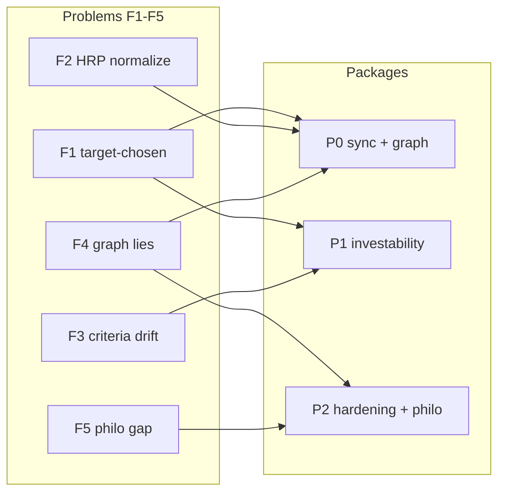
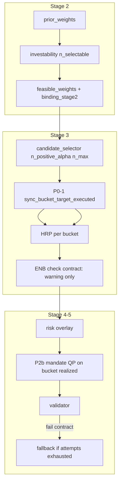

# Allocation Contract — Execution Alignment (P0 / P1 / P2)

**Date:** 2026-06-03  
**Status:** Approved for implementation — grill complete for P0/P1/P2; see [Grill decisions](#grill-decisions-locked)  
**Artifacts:** `artifacts/2026-06-01/` (incident repro), `scripts/diagnose_2026_06_01_infeasibility.py`

---

## 1. 풀고자 한 문제 (Problem statement)

### 1.1 배경 — 왜 이 작업이 필요한가

Pluto 파이프라인은 **Stage 2(Research)** 에서 8버킷 macro 비중을 정하고, **Stage 3(Allocator)** 에서 ETF 선정·최적화로 체결합니다. Allocation Contract(Phase 0~1)를 도입한 이유는 macro–micro 갈등을 **규칙을 Stage 3에 계속 붙이는 대신**, Stage 2에서 **“오늘 universe로 실행 가능한 계약”**을 남기고 Stage 3를 단순화하기 위함이었습니다.

그런데 **2026-06-01** 실跑와 cold validation에서 다음이 드러났습니다.

- Contract를 켜도 **Stage 2가 말하는 feasible**과 **Stage 3가 실제로 살 수 있는 포트**가 **다른 기준**으로 계산됨  
- 그 불일치가 **HRP 정규화 개입·위험자산 70% 초과·validator 실패·fallback**으로 이어짐  
- **philosophy.md**는 5버킷·feasible 중심 narrative인데, **portfolio.json**은 다른 경로로 만들어져 **대회/운용 평가의 “철학 ↔ 실제 투자 일치”**를 해침  
- 실패 시 **원인이 숨겨짐** (retry allocator, fallback이 validator를 건너뜀, `validation_passed=True`)

**이 spec/plan이 풀려는 핵심 질문은 하나입니다.**

> **“Stage 2 macro 계약(feasible)과 Stage 3 실행(선정·비중)이 같은 규칙 아래 정렬되고, 그 과정이 philosophy·artifact·validator에 정직하게 남는가?”**

“최적화 알고리즘을 BlackRock급으로”가 아니라, **신뢰 가능한 실행·감사·평가 가능한 문서**가 목표입니다.

### 1.2 제품·평가 관점의 요구 (사용자 명시)

| 요구 | 의미 | 이 plan에서의 대응 |
|------|------|-------------------|
| **철학 ↔ 실제 일치** | `philosophy.md`의 비중·스토리가 `portfolio.json`·attribution과 대조 가능 | P2d Philo trace, P2d 8-bucket prior/feasible/executed/final 표 |
| **실패도 설명 가능** | 포트가 비거나 mandate 미통과여도 **왜**인지 문서화 | Philo fail, `ContractInfeasibleError` / `BucketSyncError`, trace |
| **Contract 유지** | “싸게” contract 끄기보다 **계약 모델을 정직하게** | Q1 keep contract; P1 investability |
| **숨기지 않기** | silent normalize, fake pass, 의미 없는 retry 금지 | Q3 3a, P0-2/2a, P0-2a |

### 1.3 구조적 실패 모드 (해결 대상 5가지)

| ID | 실패 모드 | 증상 | 근본 원인 |
|----|-----------|------|-----------|
| **F1** | Target–chosen mismatch | `feasible(cash)≈15%`, `chosen=[]` | Stage 2는 `n_eligible`, Stage 3는 `alpha>0` → `n_max=0` |
| **F2** | HRP on empty/wrong target | `hrp_final_norm_intervened`, risk ~82% | 빈 버킷 target>0 → 잔여 질량 재정규화 |
| **F3** | Stage 2/3 criteria drift | `binding_stage2=ok`인데 실행 불가 | investability 정의 불일치 |
| **F4** | Graph / audit dishonesty | retry HRP, fallback→PM, `validation_passed=True` | validator 우회·DoF 없는 재시도 |
| **F5** | Philosophy–portfolio gap | 5-bucket narrative vs 8-bucket·실행 경로 | `philosophy.py` 미동기, executed target 없음 |

### 1.4 Reference incident — 2026-06-01

**관측된 사실 chain** (PyPortfolioOpt infeasible가 아님 — **mandate·실행 불일치**):

```text
Stage 2  list_eligible(cash) → n_eligible=9, binding_stage2=ok
         feasible cash_mmf ≈ 15.2%

Stage 3  n_positive_alpha(cash)=0 → n_max=0 → chosen=[]
         contract_mode → legacy cash_spillover OFF
         HRP: empty cash bucket skipped, remaining weights normalized
         → risk_asset share ~81.7% (> 70% mandate)

Stage 5  mandate validator FAIL
Graph    retry_allocator (no new information)
         fallback → portfolio_manager (validator SKIPPED)
         validation_passed set True
```

**잘못된 진단을 피하기 위한 한 줄:** infeasible QP가 아니라 **“실행 불가 macro target에 optimizer가 맞춰진 뒤 risk가 터진 것”**.

### 1.5 의도적으로 하지 않는 것 (Non-goals)

- Contract **비활성화**로 증상만 가리기 (`allocation_contract_enabled=False`)  
- Stage 3에 measure/realign/cap **규칙 누적**으로 같은 갈등 재처리  
- Safe bucket `require_positive_alpha=False` 정책 변경 (별도 제품 PR)  
- HRP 결과를 contract **envelope**에 투영 (**P3** 별도 spec)  
- 업스트림 factor 모델 전면 재설계 (I9 등)

### 1.6 “싼 대안” 검토 요약 (왜 P0/P1/P2인가)

| 대안 | F1–F5 해소? | 판단 |
|------|-------------|------|
| Contract off + spillover on | F1 부분, F3·F5·감사 약화 | Q1에서 기각 |
| Stage 3만 `n_max≥1` | F1 완화, macro 왜곡 가능 | 단독으로 부족 |
| P0만 (sync) | F1·F2 완화, F3·Stage 2 거짓말 잔존 | PR-1만으로 incident 방어, **정직한 contract 아님** |
| P0+P1 | F1–F3 근본 | **최소 정직 contract** |
| P0+P1+P2 | F1–F5 + overlay/ENB/philo | **대회·운용 eval까지 포함한 목표 상태** |

---

## 2. 성공 기준 (Definition of done)

### 2.1 기능

- [ ] Stage 2 `feasible`은 Stage 3와 **동일 `n_selectable`(alpha probe)** 기준 (P1-1 B)  
- [ ] Stage 3는 `chosen=0` & `target>0` 버킷에 HRP하지 않음 — **sync → R spill → optional mandate QP** (P0-1)  
- [ ] R empty / overflow 무수신처 → **fail-fast + 상세 리포트** (Q3, P1-2a)  
- [ ] Contract run: validator fail 시 **retry_allocator 없음**, fallback **→ validator** (P0-2)  
- [ ] Fallback 후 validator fail → **weights 유지 + `validation_passed=false`** (P0-2a)  
- [ ] `philosophy.md`: LLM 본문 + **`## 실행 정합성`** (P2d); 실패 run도 philo+trace (Philo fail)

### 2.2 Eval / 대회

- [ ] Golden `as_of`: philosophy **executed %** ↔ attribution ±0.1pp  
- [ ] Final bucket rollup ↔ `portfolio.json` ±0.1pp  
- [ ] 2026-06-01 repro: **사전에** feasible cash≈0 또는 Stage 2/3 명시 fail — **risk 82% → validator fail → fake pass** 경로 재현 불가

### 2.3 PR 순서 (unchanged)

| PR | Package | 주로 닫는 F# |
|----|---------|-------------|
| PR-1 | P0 (+ P2d minimal trace, graph) | F1, F2, F4, F5 partial |
| PR-2 | P1 | F1, F3, F5 (Stage 2 honesty) |
| PR-3 | P2 | F4 residual, F5 full, overlay risk |

---

## 3. 문제 → 패키지 매핑



| Package | 해결하는 문제 | Grill에서 잠근 핵심 |
|---------|---------------|---------------------|
| **P0** | F1, F2, F4 | 2a spill→R; risk>70% QP; 3a; fallback→validator; P0-2a |
| **P1** | F1, F3 | Alpha 1회(B); overflow cash skip(a); Stage 2 fail-fast(a) |
| **P2** | F4, F5 | Skip retry; overlay QP(a); ENB warning only(a); philo trace/fail(a); novelty gate(a) |

---

## 4. Spec / plan 검토 (메타)

| 영역 | 상태 | 비고 |
|------|------|------|
| Problem ↔ PR traceability | ✅ | §1–3 |
| Grill decisions | ✅ | All P0/P1/P2 forks locked |
| Architecture diagram | ✅ | Stage 2–5 data flow |
| Test plan | ✅ | Unit + E2E matrix |
| P3 envelope | ⏳ | Out of scope |
| Implementation estimates | ✅ | PR-1~3 day ranges |

**리스크 (구현 시):**

1. **PR-1 without PR-2** — incident는 막지만 Stage 2 feasible이 여전히 거짓말일 수 있음 → PR-2를 가깝게 follow.  
2. **Alpha probe at Stage 2** — `research_manager`에 데이터 의존성 추가; 실패 시 명확한 error.  
3. **Philo LLM drift** — 본문은 여전히 LLM; **eval은 trace 부록을 source of truth로**.

---

## 5. Goal (implementation north star)

Keep **allocation contract** as Stage 2 SSOT: **`prior`** = macro narrative, **`feasible`** = executable center (same rules as Stage 3). Stage 3 must **never** optimize against bucket targets with **zero** selectable ETFs (`alpha > 0`, adaptive `n_max`).

All materialized paths (success, fallback, failure) must be **auditable** in `allocation_attribution`, `philosophy.md` execution trace, and honest `validation_passed`.

## Non-goals

- HRP post-projection onto 8-bucket **envelope** (separate **P3** track)  
- Changing `require_positive_alpha=False` for safe buckets (unless future policy PR)  
- Replacing allocation contract with legacy-only spillover

---

## Grill decisions (locked)

| ID | Decision |
|----|----------|
| Q1 | **Keep contract** — do not disable for “cheaper” path |
| Q2 | **P0-1 = 2a** — spill only to **R** (chosen ∧ `n_positive_alpha>0`), prior-proportional |
| Q2+ / **P0-1b** | **a** — `project_to_mandate_qp` **only if** `sum(RISK) > 0.70` after spill |
| Q3 | **3a** — if **R empty** → `RuntimeError` with detailed user-facing reason |
| **P2a** | Skip `retry_allocator` when contract (with P0-2) |
| P2 bundle | **P2b=a**, **P2c=a**, P2d+philo trace/fail, **P2e=a** novelty gate |
| **P1-1** | **B** — alpha computed **once** in `research_manager`; state → contract + Stage 3 reuse |
| **P1-2** | **a** — if `n_selectable(cash)==0`, skip cash hop; route `lost` to **all** buckets with `n_selectable>0`, prior-proportional |
| **P1-2a** | **a** — if `lost>0` and no recipient → **`ContractInfeasibleError` at Stage 2** (shared message builder with P0 `BucketSyncError`) |
| **P0-2** | **a** — `fallback → validator` → finalize or `portfolio_manager`; no `retry_allocator` when contract |
| **P0-2a** | **a** — if validator still fails after fallback: **emit fallback weights** + `validation_passed=false` + violations (no emergency rewrite, no empty port) |
| **Philo trace** | **a** — hybrid: LLM narrative + **mandatory** deterministic `## 실행 정합성` appendix (`render_execution_trace`) |
| **Philo fail** | **a** — on `ContractInfeasibleError` / `BucketSyncError`: still write `philosophy.md` (short failure lead-in + full trace; portfolio optional empty) |

---

## Architecture



---

## P0 — Execution sync + graph honesty

### P0-1 `sync_bucket_target_executed`

**Where:** `portfolio_allocator.py` — immediately after `select_etf_candidates`, before spillover block (contract mode still skips legacy spillover).

**Inputs:**

- `bucket_target` (feasible from state)  
- `candidates.bucket_to_tickers`  
- `alpha_scores_by_bucket` from attribution (same run)  
- `prior_weights` from `research_decision.allocation_contract.prior_weights` (spill weights)

**Algorithm:**

1. Start `executed = dict(bucket_target.weights)`.  
2. **Donors:** buckets with `executed[b] > ε` and `len(chosen[b]) == 0`.  
3. `lost = sum(executed[b] for donors)`. Zero donor weights.  
4. **R:** `{ b' | len(chosen[b'])>0 AND n_positive_alpha(b')>0 }` where `n_positive_alpha` counts eligible tickers with `alpha_scores[t] > 0`.  
5. If **R empty** → build `BucketSyncError` (see §3a message) → `raise`.  
6. For each `b' in R`: `executed[b'] += lost * prior[b'] / sum(prior[b'] for b' in R)`.  
7. If `sum(executed[b] for b in RISK_BUCKETS) > MANDATE_RISK_CAP + ε` → `executed = project_to_mandate_qp(executed)`. Set `mandate_clip_applied = True`.  
8. Replace optimizer input: `bucket_target = BucketTarget(weights=executed, bond_tips_share=unchanged)`.  
9. Attribution: `bucket_target_stage2`, `bucket_target_executed`, `bucket_sync_audit`.

**`bucket_sync_audit` schema (minimum):**

```json
{
  "donors": [{"bucket": "cash_mmf", "target_pp": 15.2, "n_eligible": 9, "n_positive_alpha": 0, "binding_stage2": "ok"}],
  "recipients": [{"bucket": "kr_bond", "received_pp": 8.1, "prior_share": 0.53}],
  "lost_mass_pp": 15.2,
  "R_buckets": ["kr_bond", "kr_equity"],
  "mandate_clip_applied": true,
  "risk_sum_pre_clip": 0.82,
  "risk_sum_post_clip": 0.70
}
```

**State key:** `bucket_target_executed` on `AgentState` (optional mirror for philosophy / reports).

### P0-1 — User-facing error (3a)

**Classes** in `tradingagents/skills/portfolio/bucket_sync.py` (new small module):

- `BucketSyncError` — Stage 3, R empty after 2a spill attempt  
- `ContractInfeasibleError` — Stage 2, P1-2a overflow with no `n_selectable>0` recipient  
- `build_infeasibility_report(...)` — shared body for both (donors, exclusions, actions)

**Message sections (plain language, Korean allowed in CLI wrapper):**

1. What failed (no bucket can absorb unplaced macro weight)  
2. Donor table (bucket, target %, chosen count, n_eligible, n_positive_alpha, binding_stage2)  
3. Per-bucket exclusion reason for R  
4. Stage 2 vs Stage 3 criteria mismatch explanation  
5. Suggested actions (check factor panel, P1 deploy, as_of data)  
6. `as_of_date`, path to `allocation_attribution`

Also: `logger.error` + `attribution["bucket_sync_error"] = {...}` so artifacts capture without rerun.

### P0-2 Fallback ↔ validator (grill: **a**)

**Current problem:** `fallback → portfolio_manager` skips validator; fallback sets `validation_passed=True`.

**Target (a):**

```text
validator fail (contract, attempts exhausted)
  → fallback
  → mandate_validator (same node)
  → finalize | (no second retry_allocator when contract_skip_allocator_retry)
  → if still fail: portfolio_manager (validation_passed=False, report attached)
```

**State flags for philosophy / artifacts:** `fallback_used=True`, `allocator_retry_skipped=True` (when contract), `validation_passed`, `validation_report`.

**P0-2a (grill: a):** Second validator pass on fallback weights:

- If **fail**: write `weight_vector` = fallback weights unchanged; `validation_passed=False`; full `validation_report` in state + philo trace (`mandate_status: failed_after_fallback`).  
- Do **not** run emergency safe EW (`conditional_logic` last-resort) in contract mode unless separate future PR.  
- `portfolio.json` reflects fallback holdings; philosophy narrative must not claim mandate clean — trace lists hard violations.

**Changes:**

| File | Change |
|------|--------|
| `builder.py` | `fallback → validator` edge (replace direct `portfolio_manager`) |
| `conditional_logic.py` | Remove unconditional `validation_passed=True` on success; return weights only |
| `validation_router` | If `contract_skip_allocator_retry` and contract present: never `retry_allocator` |

**Config:** `contract_skip_allocator_retry: bool = True` (default when `allocation_contract_enabled`).

**Loop guard:** After fallback, if validator still fails → `portfolio_manager` with `validation_passed=False` and explicit `validation_report` (do not re-enter fallback).

### P0 — Tests

| Test | Assert |
|------|--------|
| `test_sync_spill_to_R_proportional` | cash 15% / 0 chosen → bond+equity receive per prior |
| `test_sync_mandate_clip_when_risk_high` | spill pushes risk >70% → post sum ≤70% |
| `test_sync_R_empty_raises` | all buckets n_positive_alpha=0 → `BucketSyncError`, message contains donor table |
| `test_contract_skip_retry_router` | contract + fail → route fallback not allocator |
| `test_fallback_goes_through_validator` | mock graph: fallback then validator called |

---

## P1 — Stage 2 investability honesty

### P1-1 Shared selectable count (grill: **B**)

**Problem:** `compute_investability` uses `n_eligible = len(list_eligible_tickers)`; Stage 3 uses `n_positive_alpha`.

**Approach (B — single alpha pass):**

1. **`research_manager`** (after universe load, before `build_allocation_contract`):
   - `eligible = list_eligible_tickers(universe, probe_target, as_of)`
   - `alpha_scores_by_bucket = compute_alpha_scores_for_eligible(...)` — same entry as `candidate_selector._compute_alpha_scores` (extract to `skills/portfolio/alpha_probe.py` or public wrapper)
   - Write to state: `eligible_by_bucket`, `alpha_scores_by_bucket` (names TBD in `AgentState`)
2. **`build_allocation_contract(..., eligible_by_bucket=..., alpha_scores_by_bucket=...)`** — no second alpha call inside contract builder
3. **`candidate_selector`** — if state already has scores, **reuse**; else compute (backward compat for tests / contract-off)

**Shared helper:**

```python
def compute_bucket_selectability(
    *,
    eligible_by_bucket: dict[str, list[str]],
    alpha_scores_by_bucket: dict[str, dict[str, float]],
) -> dict[str, int]:
    """Returns n_positive_alpha per bucket (0 if no eligible)."""
```

**Stage 2 investability change:**

```python
n = n_selectable[b]  # not len(eligible) only
if n == 0 and prior_b > ε:
    thin_universe  # or no_positive_alpha when n_eligible > 0
elif prior_b > max_realizable(n, single_etf_cap):
    capped_realizable
```

**Binding:** Add `binding_stage2` value `no_positive_alpha` when `n_eligible>0` but `n_selectable==0`.

**PR-2 touch list (add):** `research_manager.py`, `agent_states.py`, `allocation_contract.py`, `candidate_selector.py`, new `alpha_probe` module (thin re-export of `_compute_alpha_scores`).

### P1-2 Overflow when cash is thin (grill: **a**)

**Change `project_investability_risk_overflow`:**

- After computing `lost`, if `n_selectable["cash_mmf"] == 0` (P1-1: use `n_selectable` on `InvestabilitySnapshot`), **do not** add `lost` to `feasible["cash_mmf"]`.  
- **Recipients:** every bucket with `n_selectable > 0` (risk + safe), weights ∝ `prior_weights[b]`.  
- Cash cap / risk-overflow sub-path runs only on mass that legitimately sits in cash after thin-bucket removal.  
- **P1-2a (grill: a):** if `lost > ε` and no bucket has `n_selectable > 0` → raise `ContractInfeasibleError` from `bucket_sync.py` (same `build_infeasibility_report(...)` as Stage 3). Do not renormalize into a fake feasible vector.

**Rationale (P1-2a = a):** see § “Why Stage 2 fail-fast” below.

**Tests:** extend `test_allocation_contract.py` — cash `n_eligible>0`, `n_selectable=0`, prior cash 15% → feasible cash ≈ 0, mass on bond/equity per prior; all `n_selectable=0` → `ContractInfeasibleError`.

#### Why Stage 2 fail-fast (P1-2a = a)

1. **Same contract as Q3 (3a).** You chose to fail with a full explanation, not hide behind fallback or silent normalize. If every bucket has `n_selectable=0`, the run is not investable under the rules you already locked — reporting that after HRP wastes work and reads like a bug in the optimizer instead of a data/alpha problem.

2. **Renormalize (b) lies to downstream.** Warning + `_renormalize` can still emit a `feasible_weights` vector that sums to 1 but no bucket can hold ETFs. Stage 3 then repeats the 6/1 path (target > 0, chosen = 0) until `BucketSyncError`. One failure mode, two stages, harder ops.

3. **Defer-only to Stage 3 (c) delays the signal.** Stage 2 `binding_stage2` and monthly philosophy would still show “ok” or plausible feasible weights while the true blocker is known at contract build. Fail-fast keeps **Stage 2 SSOT honest**.

4. **Cheaper and clearer ops.** Alpha/universe already computed in `research_manager` (P1-1 B); failing there skips HRP, overlay, and validator churn. The shared `build_infeasibility_report` keeps Stage 2 and Stage 3 messages consistent so users do not learn two different error dialects.

5. **Distinct error types, one report shape.** `ContractInfeasibleError` (Stage 2, no recipients for `lost`) vs `BucketSyncError` (Stage 3, R empty after selection) — different triggers, same donor table / fix hints. Graph can catch both and surface `safety_diag` without marking `validation_passed=True`.

### P1 — Tests

| Test | Assert |
|------|--------|
| `test_investability_uses_n_selectable` | eligible 9, alpha+ 0 → thin, feasible 0 |
| `test_overflow_skips_thin_cash_sink` | cyclical thin + cash thin → lost not restored to cash 15% |

---

## P2 — Operational hardening

### P2a — Skip allocator retry (bundled in P0 PR)

See P0-2. Contract + validator fail → fallback, not second HRP.

### P2b — Overlay post-clip (grill: **a**)

**Where:** end of `risk_judge` after `apply_risk_overlay`, before return.

Same rule as P0-1b: QP **only if** `sum(RISK_BUCKETS) > 0.70` after overlay (not unconditional).

1. Map ticker weights → bucket totals (`realized_bucket_weights`).  
2. If `sum(RISK) > 0.70` → `bucket_adj = project_to_mandate_qp(bucket_totals)`.  
3. Rescale ticker weights within each bucket to match `bucket_adj` (preserve relative weights inside bucket).  
4. Re-check single-name 20% cap (existing overlay cap logic).  
5. Attribution: `overlay_mandate_clip_applied`, `overlay_risk_pre/post`.

**Config:** `contract_overlay_risk_clip: bool = True` (default true when contract).

### P2c — ENB EW disabled in contract mode (grill: **a**)

In `portfolio_allocator` post-ENB block:

```python
if contract_mode:
    enb_action = "warning_only_contract"  # no EW rewrite; weights unchanged
    if 0 < enb_value < ENB_WARNING_THRESHOLD:
        logger.warning(...)  # same thresholds, measure only
elif 0 < enb_value < ENB_CRITICAL_THRESHOLD:
    ... existing EW fallback (legacy / contract-off only) ...
```

**Not** “no safeguards”: validator, overlay clip (P2b), mandate caps, and philo trace still apply. ENB is an **audit signal**, not a second portfolio rewrite under contract.

### P2d — Philosophy 8-bucket + execution trace (eval: 철학 ↔ 실제 일치)

**File:** `tradingagents/reports/philosophy.py`, `portfolio_manager.py`

**User requirement:** Competition eval treats **philosophy vs actual holdings** alignment as a first-class score. Narrative must not describe a portfolio the pipeline did not build.

**Deliverables:**

1. **Prompt inputs (`_build_state_summary`)** — extend with contract + execution fields (numbers for LLM sections 3, 4, 5, portfolio table).  
2. **Deterministic appendix (grill: a)** — `render_execution_trace(state) -> str` **always** appended after LLM body under `## 실행 정합성` so judges see ground truth even if LLM drifts.

**New / updated prompt sections in `PHILOSOPHY_PROMPT`:**

| Section | Source |
|---------|--------|
| 제안 포트폴리오 비중 | **8-bucket** rows; columns: prior %, feasible %, executed %, final ticker-implied bucket % |
| (new) ## 실행 정합성 (Execution alignment) | Deterministic block — not LLM-paraphrased |

**Deterministic block must include (when contract enabled):**

| Block | Fields |
|-------|--------|
| Stage 2 contract | `prior_weights`, `feasible_weights`, `binding_stage2` (top flags), `projection_audit` summary (cash cap, overflow recipients) |
| Stage 2 failure | `ContractInfeasibleError` → philo fail path (see **Philo fail**) |
| Stage 3 sync | `bucket_sync_audit`: donors, R, lost_mass_pp, `mandate_clip_applied`, risk pre/post |
| Stage 3 selection | per-bucket `n_eligible`, `n_selectable`, `n_max`, `chosen` tickers (abbrev list) |
| Stage 3 optimizer | `method`, `enb_action`, `hrp_final_norm_intervened` (from attribution) |
| Stage 4 | overlay strength/multiplier; `overlay_mandate_clip_applied` if P2b |
| Stage 5 | `validation_report.passed`, violation codes; **`fallback_used`**; **`allocator_retry_skipped`**; path: validator→fallback→validator (P0-2a) |
| Final | top holdings + **bucket realized vs executed** max abs delta (pp) |

**8-bucket table helper:** replace `_format_bucket_target` with `_format_bucket_weights_8(state)` reading `allocation_contract` + `bucket_target_executed` + final weights rolled up to buckets.

**Ship:** P2d appendix can land in **PR-1** (minimal trace: sync audit + executed) and expand in **PR-3** (overlay/validation/fallback flags). User asked for full trace — target complete by end of PR-3.

**`write_philosophy` flow:**

```python
text = generate_philosophy(state, deep_llm)  # LLM body
text += "\n\n" + render_execution_trace(state)  # mandatory appendix (grill a)
```

**Acceptance (eval):** For a golden `as_of`, philosophy table “executed %” matches `allocation_attribution.bucket_target_executed` within 0.1pp; final bucket column matches `portfolio.json` rollup.

#### Philo on pipeline failure (grill: **a**)

When `ContractInfeasibleError` or `BucketSyncError` aborts allocation (before or after partial weights):

1. Graph routes to **`portfolio_manager` failure branch** (or dedicated `write_failure_artifacts`) — do not skip docs.  
2. `philosophy.md` contents:
   - Fixed Korean lead-in (template, no long LLM): what failed, error type, `as_of_date`, pointer to trace.  
   - **`render_execution_trace(state)`** with `infeasibility_report` embedded (donors, exclusions, actions).  
   - Optional: single short `deep_llm` paragraph **only if** `PHILOSOPHY_ON_FAILURE_LLM=false` by default (recommend **false** — numbers stay deterministic).  
3. `portfolio.json`: empty weights or omit file — document in trace (`final_portfolio: none`).  
4. `safety_diag["pipeline_failure"]` = error class + report dict.

**Rationale:** Evaluators score narrative vs holdings; a failed day still needs a **documented reason**, not a missing `philosophy.md`.

### P2e — Stage 2 LLM novelty gate (grill: **a**)

**File:** `research_manager.py`

- Before `generate_stage2_narrative_views`, if `compute_novelty(...) < stage2_llm_min_novelty` (default **0.05**): **skip LLM**, set `safety_diag["stage2_llm_skipped"]` with novelty score + threshold.  
- Philosophy: §3 may cite factor-only rationale when skipped; `render_execution_trace` must show `stage2_llm: skipped (novelty=...)`.  
- Optional eval script `scripts/eval_stage2_llm_overlay.py` for offline threshold review (does not change prod gate).

---

## Configuration summary

| Key | Default | Package |
|-----|---------|---------|
| `allocation_contract_enabled` | `True` | existing |
| `contract_skip_allocator_retry` | `True` | P0 |
| `contract_overlay_risk_clip` | `True` | P2b |
| `stage2_llm_min_novelty` | `0.05` | P2e |
| `contract_enb_ew_fallback` | implicit `False` in contract | P2c |

---

## Implementation plan (PR order)

### PR-1 — P0 Execution sync + graph (`contract-exec-sync-p0`)

**Scope:**

- `skills/portfolio/bucket_sync.py` — sync + error builder  
- `portfolio_allocator.py` — call sync, state keys, attribution  
- `agent_states.py` — optional `bucket_target_executed`  
- `graph/builder.py`, `conditional_logic.py` — P0-2 + P2a  
- `default_config.py` — `contract_skip_allocator_retry`  
- `reports/philosophy.py` — P2d  
- Unit tests: bucket_sync, validation_router

**Acceptance:**

- Repro fixture mimicking 2026-06-01 cash alpha all ≤0: fails with readable error **or** (if one bucket has alpha+) succeeds with `hrp_final_norm_intervened=False` and risk ≤70% pre-validator  
- `allocation_attribution` contains `bucket_target_executed`

**Estimate:** 1–2 days

### PR-2 — P1 Contract investability (`contract-investability-p1`)

**Scope:**

- `skills/portfolio/selectability.py` (shared probe)  
- `allocation_contract.py` — investability + overflow  
- `research_manager.py` — pass alpha probe inputs into `build_allocation_contract`  
- `candidate_selector.py` — use shared count helper (thin refactor)  
- Tests: allocation_contract + integration smoke

**Depends on:** PR-1 (soft — can parallelize but prefer PR-1 first for incident path)

**Acceptance:**

- Bucket with eligible>0, alpha+=0 → `binding_stage2` in (`thin_universe`, `no_positive_alpha`), feasible 0  
- No feasible cash 15% with `n_selectable(cash)=0`

**Estimate:** 2–3 days

### PR-3 — P2 Overlay + ENB + LLM gate (`contract-hardening-p2`)

**Scope:**

- `risk_judge.py` — P2b clip  
- `portfolio_allocator.py` — P2c ENB branch  
- `research_manager.py` — P2e gate  
- `scripts/eval_stage2_llm_overlay.py` (optional)  
- Tests: overlay clip, ENB action string

**Depends on:** PR-1

**Estimate:** 1–2 days

### PR-4 — P3 (future, out of scope here)

HRP / optimizer envelope projection vs `allocation_contract.envelope` — separate spec.

---

## Verification matrix (E2E)

| Scenario | Expected |
|----------|----------|
| Happy path | `binding` ok, sync no donors, executed ≈ feasible |
| Cash alpha 0 | P1: feasible cash 0; P0: spill to R; or 3a if R empty |
| Duration thin Stage 2 | P1: duration feasible 0; mass to R at P0 if target still >0 |
| Validator risk fail pre-fix | contract → skip retry → fallback → validator → weights ≤20%, risk ≤70% |
| Overlay on + risk spike | P2b clip before validator |

**Command:**

```bash
pytest tests/unit/skills/research/test_allocation_contract.py \
       tests/unit/skills/portfolio/test_bucket_sync.py \
       tests/unit/agents/test_portfolio_allocator_contract.py -q
```

(Add new test modules as created.)

---

## Rollout

1. Merge PR-1 → run one historical `as_of` in shadow (check attribution only).  
2. Merge PR-2 → compare `binding_stage2` / feasible deltas on same dates.  
3. Merge PR-3 before production overlay-heavy weeks.  
4. Update monthly report template: cite **executed** bucket line, not only feasible.

---

## Open questions (post-implementation review)

- Safe-bucket `n_max >= 1` policy for tournament liquidity (separate product decision)  
- P3 envelope enforcement on HRP output vs BL/MV paths only  
- Whether `BucketSyncError` should map to CLI exit code 2 for `gaps plan` automation

---

## References

- `tradingagents/skills/research/allocation_contract.py`  
- `tradingagents/skills/research/factor_to_bucket.py` — `project_to_mandate_qp`  
- `tradingagents/skills/portfolio/factor_scorer.py` — `compute_adaptive_n_max`  
- `scripts/diagnose_2026_06_01_infeasibility.py` (incident repro)
